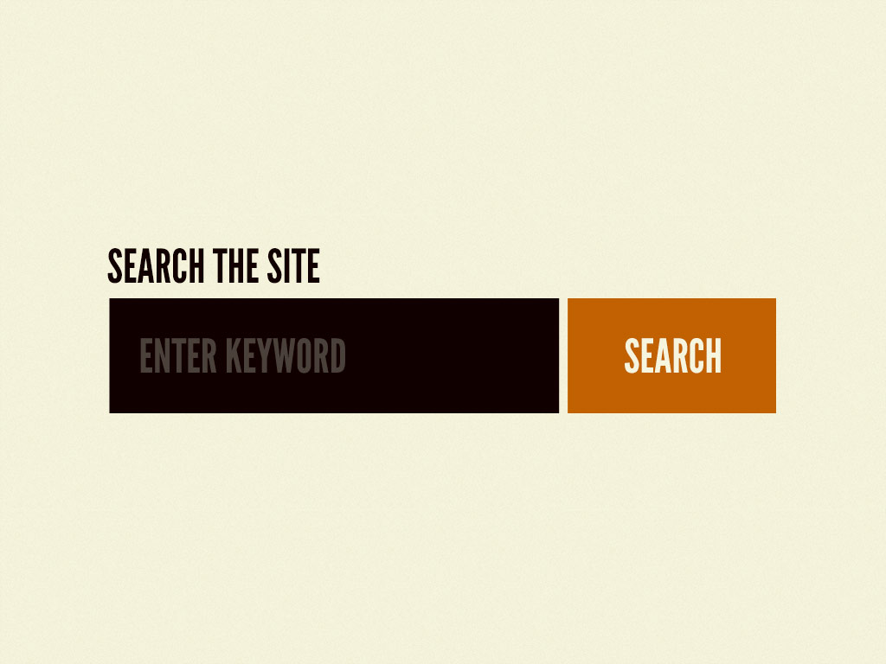
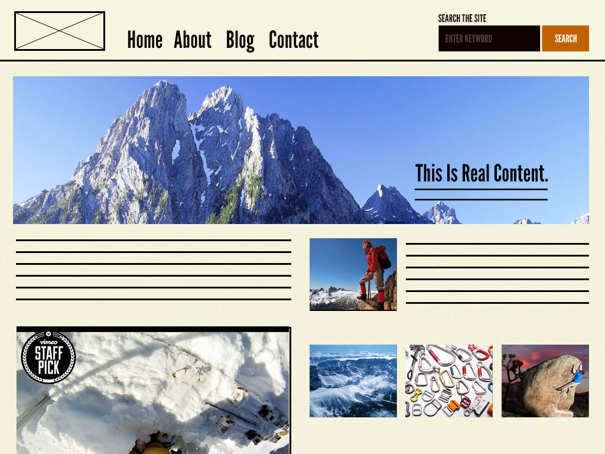

# Design System

Our design system principles are based on the `Atomic Design` by Brad Frost. (<https://bradfrost.com/blog/post/atomic-web-design/>

The aim to create a design system that is easy to understand, easy to use, and easy to build uponand consistent across all our products.

The thought is that all matter (whether solid, liquid, gas, simple, complex, etc) is comprised of atoms. Those atomic units bond together to form molecules, which in turn combine into more complex organisms to ultimately create all matter in our universe.

Similarly, interfaces are made up of smaller components. This means we can break entire interfaces down into fundamental building blocks and work up from there. That’s the basic gist of atomic design.

NOTE: Design systems are not UI kits.

## What is atomic design

Atomic design is methodology for creating design systems. There are five distinct levels in atomic design:

(1) Atoms

(2) Molecules

(3) Organisms

(4) Templates

(5) Pages

### Atoms

Atoms are the basic building blocks of matter. Applied to web interfaces, atoms are our HTML tags, such as a form label, an input or a button.

### Molecules

Things start getting more interesting and tangible when we start combining atoms together. Molecules are groups of atoms bonded together and are the smallest fundamental units of a compound.

For example, a form label, input or button aren’t too useful by themselves, but combine them together as a form and now they can actually do something together.

### Organisms

Organisms are groups of molecules joined together to form a relatively complex, distinct section of an interface.

### Templates

Templates consist mostly of groups of organisms stitched together to form pages. It’s here where we start to see the design coming together and start seeing things like layout in action.

### Pages

Pages are specific instances of templates. Here, placeholder content is replaced with real representative content to give an accurate depiction of what a user will ultimately see.

